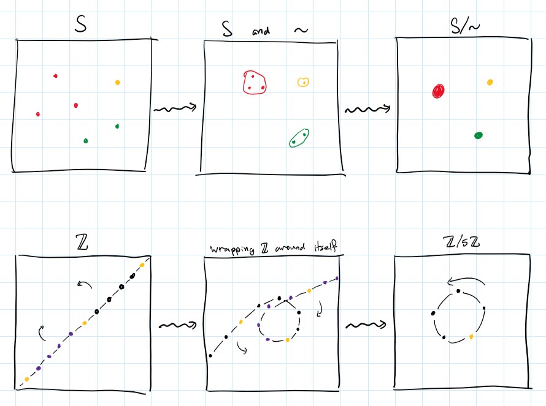
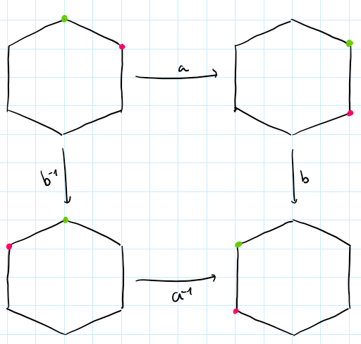
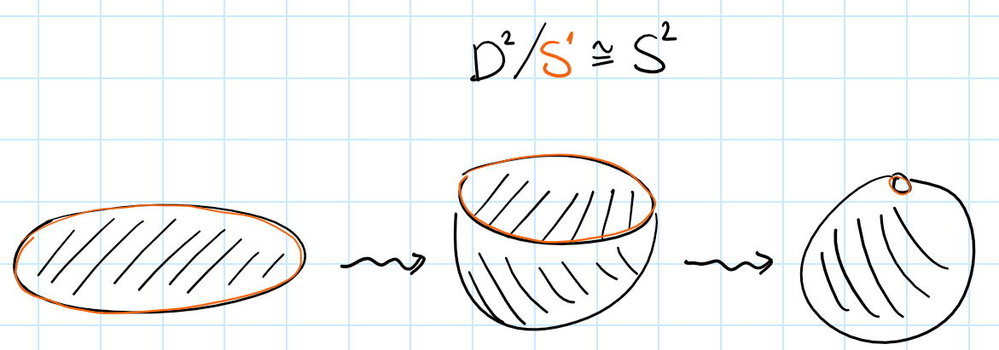
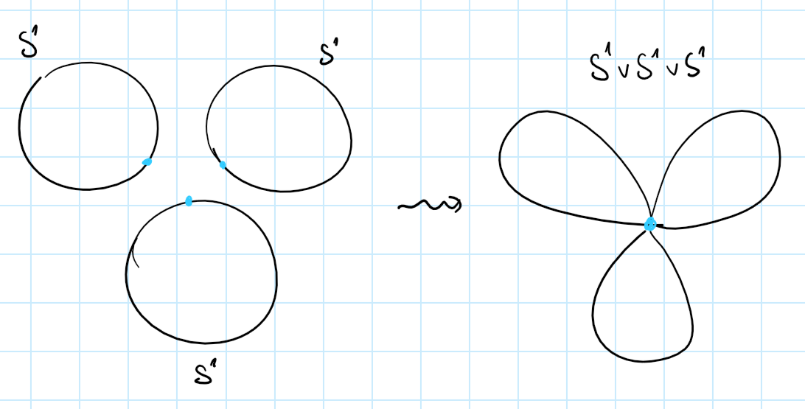
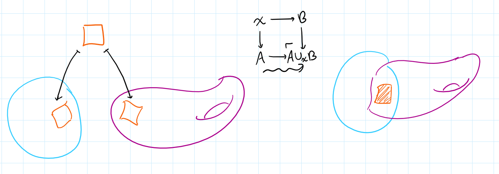
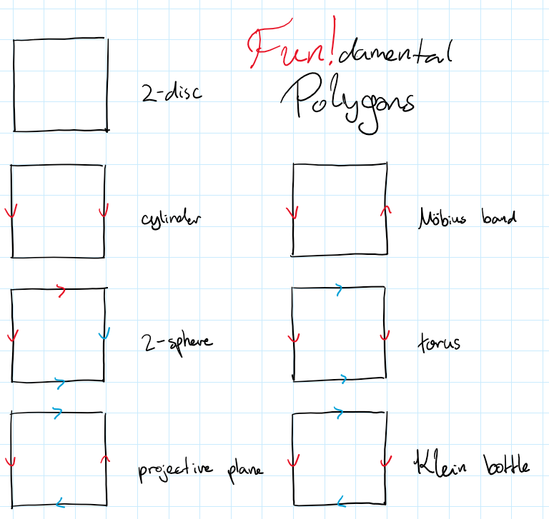

$$
\let\eqq\equiv
\let\iso\cong
\let\equiv\simeq
\let\cong\eqq

\newcommand{\Z}{\mathbb{Z}}
\newcommand{\R}{\mathbb{R}}
\newcommand{\bC}{\mathbb{C}}
\newcommand{\k}{\mathbb{k}}
\newcommand{\bP}{\mathbb{P}}

\newcommand{\epi}{\twoheadrightarrow}
\newcommand{\x}{\times}
\newcommand{\Iff}{\quad\leftrightsquigarrow\quad}

\DeclareMathOperator*\colim{colim}

\newcommand{\builder}[2]{\left\{ { #1 } \;\middle|\; { #2 } \right\}}
$$

Quotients are the formal dual of subobjects. However subobjects tend to seem much more intuitive, and are usually introduced much earlier on to students. I believe this asymmetry is justified. Quotients take slightly more advanced machinery to define, and in general there are many scenarios where limits are arguably much more intuitive than colimits. Although it's not a definitive rule, it's an undeniable pattern in human intuition.

However if you've spent some time doing proper mathematics, you surely have encountered various kinds of quotients used in various situations, yet it still takes time to build a solid intuition for what they do. In this post I hope to help you understand a large class of quotients that appears in the wild, and a mental recipe to understand nearly every quotient construction out there.

## Back to basics
Just to ease ourselves into the deal, let's recall the most basic definition
**Definition:** For a set $S$ and an equivalence relation $\sim\;\subseteq S\x S$, we denote by $S/\sim$ the set of equivalence classes, and by $[-]_\sim:S\epi S/\sim$ the projection of every element to its class. The set $S/\sim$ together with the projection is called the *quotient* of $S$ by $\sim$. When the projection is understood from context, we call just the set $S/\sim$ the quotient.

For example, for any $p$ we may define a relation on integers

$$n\cong_p m \Iff p\mid n-m$$

And by that get the well-known set of *integers mod $p$*, which we denote $\Z/p$.

In fact, $\Z/p$ inherits the additive group structure from $\Z$, and in this context we call $\Z/p$ the *cyclic abelian group of order $p$*.

In the case of groups there's something slightly deeper going on -- Given any group $G$ and an equivalence relation $\sim$ on it, the quotient $G/\sim$ has its own binary operation defined by $[x]\cdot [y] = [x\cdot y]$, however this might not be well-defined (i.e. it might depend on the specific choice of representatives). If it is well-defined, then it makes $G/\sim$ into a group.

In order to guarantee well-definedness, we require the relation $\sim$ to be *compatible with multiplication*. More specifically, it needs to be
- Left-compatible: if $x\sim y$ then $gx\sim gy$.
- Right-compatible: if $x\sim y$ then $xg\sim yg$.

Every subgroup $N\subseteq G$ induces two relations on $G$ defined by

$$x \sim_L y \Iff x^{-1}y \in N \qquad\qquad\qquad x\sim_R y \Iff xy^{-1}\in N$$

You may verify that $\sim_L$ is always left-compatible, and $\sim_R$ is always right-compatible.
In fact this statement works in the other direction: every left-compatible relation on $G$ is equal to the relation $\sim_L$ of some subgroup, and every right-compatible relation is equal to $\sim_R$ of some subgroup.

In order to unify left- and right-compatibility, and get a fully compatible relation, the concept of *normal subgroups* is introduced. Those are groups that always induce a two-sided compatible relation, hence we can always quotient by them.

For the details you can check any standard textbook in abstract algebra, but what I'm trying to convey to you is a common idea that sub-structures often induce relations, hence can be quotiented by. In the case above, given a normal subgroup $N\subseteq G$, we write $G/N$ for the induced quotient group.

The subset $p\Z = \builder{pn}{n\in\Z}\subseteq\Z$ happens to be a normal subgroup, and the quotient $\Z/p\Z$ coincides exactly with the cyclic subgroup $\Z/p$ from earlier.

## Quotients as identifications
After seeing some examples we are ready to talk about what quotients really mean. The whole point of this post is to drill a simple mantra into your brain:

<h4 style="text-align: center; font-style: italic">Quotients are identifications!</h4>

The meaning of this will become clearer as you read, but we can already see glimpses of intuition in the simple case of sets. When we quotient a set by an equivalence relation, we are essentially forcing related points to be equal. In other words, we *identify* related points. An alternative perspective is; we *identify* each equivalence class down to a single point.

You can literally think of it like taking two points and merging them together. Similarly when taking a quotient of $\Z$ you can literally wind it infinitely many times in a cycle and merge the related points to one another. I drew a comic to help you think about it:
{: width="80%" style="display:block; margin-left:auto; margin-right:auto" }

This intuition can carry us very far, and later we will see more examples to strengthen it. However there is another way to think about this identification process, and that is what I will talk about next.

## Group presentations
Denote by $\langle x,y\rangle$ the free group on two generators. Elements of this group are finite strings built out of $x,y$ and their "formal inverses" $x^{-1},y^{-1}$, which satisfy the equations $xx^{-1}=x^{-1}x=yy^{-1}=y^{-1}y=e$. We often write $x^n$ for the string $\underbrace{x\cdots x}_{n\text{ times}}$.
The element $e$ denotes the empty string, and is a unit with respect to string concatenation, which is the operation of the group. This evidently generalizes to any set of generators (even infinite sets), for example you may recognize the free group on a single generator simply as $\langle x\rangle \iso \Z$.

However, just free groups are quite restrictive. Their generators are essentially independent of one another. Sometimes, we want to add some "relations" between the generators, as in certain equations they should satisfy. Let's return to the cyclic groups as an example; $\Z/p$ can be generated by a single element, which we denote $a$, but this generator also needs to satisfy the equation $a^p=e$ (or if you prefer additive notation, $pa=e$, though I will stick to multiplicative notation for consistency). And of course, it must in addition satisfy any equation implied by it and by the group axioms, such as $a^na^m=a^{n+m-p}$ and $a^{p+5}=a^5$.

For a more intricate example, consider the dihedral group $D_{2n}$ which consists of self-symmetries of a regular $n$-gon. We express this group through two generators, $a$ which denotes rotation by $\frac{2\pi}{n}$ radians, and $b$ which denotes horizontal reflection. Together they satisfy certain equations. For example, performing $n$ rotations takes you back to the beginning, so $a^n=e$. Similarly, performing two reflections, $b^2=e$. Lastly, you can verify for yourself that a rotation followed by a reflection is equivalent to a reflection followed by a rotation in the counter-clockwise, which may be written as $ab=b^{-1}a^{-1}$. Below is an example for the case $n=6$:
{: width="80%" style="display:block; margin-left:auto; margin-right:auto" }

All of this information about $D_{2n}$ can be packed into a concise description, which can be proven to describe $D_{2n}$ uniquely up to isomorphism,

$$D_{2n} \iso \langle a,b\mid a^n=e,b^2=e,ab=b^{-1}a^{-1}\rangle$$

This is called a *presentation* of $D_{2n}$. In particular it is a *finite presentation*, because there are finitely many generators and finitely many equations relating them. A single group may have many different presentations.

As it turns out, presentations are merely fancy quotients. Notice the equation above is equivalent to a slightly nicer one:

$$ab=b^{-1}a^{-1} \quad\Iff\quad (ab)^2=e$$

This is nice because now we have three elements $a^n,b^2,(ab)^2$, that we want to identify with the identity $e$. When we talk about "equations implied by" our initial set of equations, we simply mean that not only those three elements are identified with zero, but the whole subgroup that they generate. We denote this subgroup with suggestive notation $\langle a^n,b^2,(ab)^2\rangle \subseteq \langle a,b\rangle$ (keep in mind the subgroup is not free!).

More formally, the above presentations are re-written as quotients like so

$$\Z\iso\frac{\langle x\rangle}{\langle e\rangle} \quad\qquad \Z/p\iso\frac{\langle a\rangle}{\langle a^p\rangle} \qquad\qquad D_{2n} \iso \frac{\langle a,b\rangle}{\langle a^n,b^2,(ab)^2\rangle}$$

This time the intuition I am trying to drill into your head is not a physical identification of points, but an algebraic identification of expressions. Given a set of equations, we force all of them to hold in our group. Due to the group axioms, this might in turn force even more equations to be true, and all of this data can be encoded in just the subgroup of everything that gets squished down to the identity $e$.

## Quotients as algebraic identifications
A very similar game can be played with modules, in place of groups. In fact this works with any algebraic structure (in the universal-algebraic sense), or alternatively for any $T$-algebra where $T$ is a monad.

For another algebraic example, you may think of the field of complex numbers as the field $\R$ where we "freely adjoin" a new element, $\R[x]$, and then we force the new element to satisfy a desired equation $x^2=-1$ by taking an appropriate quotient

$$\bC \iso \frac{\R[x]}{(x^2+1)}$$

This proves that $\bC$ is a finitely generated $\R$-algebra.

Vector spaces could serve as an example which has both an algebraic and geometric nature. Consider a vector space $V$ and a subspace $W\subseteq V$. You may already guess by now that we can't just identify $W$ with $0$, because the result won't be a vector space anymore. Instead we need to consider all the "linear implications" of identifying $W$ with $0$, or in other words we must consider all the cosets of $W$. Hence we collapse every subspace parallel to $W$, and the result will be the orthogonal complement $W^\perp \subseteq V$.

For a more algebraic instance, we can turn to the popular explicit construction of tensor products: Have vector spaces $U,V$ (over the same field), then we can construct their *tensor product* $U\otimes V$ in the following manner.
Start from $U\oplus V$, whose elements are pairs $(u,v)$. We'd like to formally force those pairs to behave bilinearly. For this end, take the free vector space $F(U\oplus V)$ generated by all pairs. Elements of this space are formal linear combinations of pairs. But now we want to add some equations to those formal expressions, specifically we want equations that make the pairing action $(-,-)$ bilinear:

$$\begin{cases}
	\lambda(u,v) = (\lambda u,v) \\
	(u,v)+(u',v) = (u+u',v) \\
	\lambda(u,v) = (u,\lambda v) \\
	(u,v)+(u,v') = (u,v+v')
\end{cases}$$

Vector spaces are just additive groups with some extra structure, so we can use the same trick as before. Move everything to one side:

$$\begin{cases}
	\lambda(u,v)-(\lambda u,v) = 0 \\
	(u,v)+(u',v)-(u+u',v) = 0 \\
	\lambda(u,v)-(u,\lambda v) = 0 \\
	(u,v)+(u'v)-(u,v+v') = 0
\end{cases}$$

Then quotient away the subspace generated by these LHSs

$$
U\otimes V \iso \frac{F(U\oplus V)}{\left\langle \begin{array}{c} \lambda(u,v)-(\lambda u,v) \\ (u,v)+(u',v)-(u+u',v) \\ \lambda(u,v)-(u,\lambda v) \\ (u,v)+(u,v')-(u,v+v') \end{array} \;\middle|\; \begin{array}{c} u,u' \in U \\ v,v'\in V \\ \lambda\in\k \end{array} \right\rangle}
$$

Similarly we may define the exterior algebra as a quotient of the tensor algebra

$$\Lambda^*V \iso \frac{\mathbb{T}^*V}{\langle v\otimes v'+v'\otimes v \mid v\in V\rangle}$$

which will force the alternation $v\otimes v' = -(v'\otimes v)$.

## Quotients as gluings
Lastly, I'd like to explore the more geometric interpretations of quotients, which were already hinted at in various preceding examples. I strongly believe that topology is where quotients really shine, and the intuition will become very concrete (maybe that's just because I'm a topologist in denial).

For a topological space $A$ and a subset $B\subseteq A$, we maye define the *quotient space* $A/B$ where all of $B$ is identified to a single point. The tacit relation here is

$$x\sim y \Iff x,y\in B \text{ or } x=y$$

Again, we think of this identification in a very concrete geometric sense. If our spaces are made of rubber, we take all the chunk of rubber that is called $B$ and we squish it down until it becomes a point. The precise formal definition of the quotient topology is just a game with universal properties, and can be found in any standard text.
As an example, take the unit disc $D^2$ and quotient it by its boundary, the unit circle $S^1$. After identifying the entire boundary to a point, you'd end up with a sphere. You can experience this with your own hands by wrapping a napkin around a basketball. More generally we'd have a homeomorphism $\frac{D^n}{S^{n-1}} \iso S^n$.
{: width="80%" style="display:block; margin-left:auto; margin-right:auto" }

For our next example, we consider two pointed spaces $(A,a_0)$ and $(B,b_0)$. On the one hand we can take the *disjoint union*, or *coproduct* $A\amalg B$ of those spaces, disregarding their basepoints. The underlying set of this space is the disjoint union of the underlying sets of $A$ and $B$.
However in the context of pointed spaces, we tend to prefer a different operation, the wedge sum:

$$A \vee B = \frac{A\amalg B}{a_0\sim b_0}$$

Instead of just taking the two spaces as disjoint blobs, we identify their basepoints. The resulting space is also a pointed space, and in fact the wedge sum is the coproduct in the category of pointed spaces. A wedge sum of circles is aptly named a *bouquet*.
{: width="80%" style="display:block; margin-left:auto; margin-right:auto" }

As a mild generalization of this, we can take two spaces and glue them to one another along any subsets. This is formalized by the *amalgamated sum*, or *pushout* operation:
{: width="80%" style="display:block; margin-left:auto; margin-right:auto" }
In the special case where $X$ is a point, the pushout coincides with the wedge sum, $A\cup_\ast B \iso A\vee B$.
In the case where $B$ is a point and $X\hookrightarrow A$ is an inclusion map of a subset, the pushout coincides with the quotienting by a subspace, $A\cup_X\ast \iso A/X$.

More examples for this idea can be found in homotopy theory, for example the mapping cylinder, double mapping cylinder, mapping telescope, and mapping cone, are all constructions of this style.

Pushouts are themselves special cases of colimits; generally, it is well known that in reasonable cases (such as sets or topological spaces) all colimits come down to certain quotients. A diagram in $\mathsf{Top}$ can be thought of as a constallation of spaces along with maps that tell us how those spaces "fit together". The colimit of the diagram is the result of actually fitting all the spaces together, and gluing them according to the connecting maps.
As a concrete example, every manifold can be seen as a bunch of Euclidean pieces glued together along their overlaps.

## Even more examples
By now I'm sure my point came across loud and clear. Whenever you encounter a quotient (more generally, a colimit) in math you should think to yourself: what exactly is being identified here? To finish off the post, I present some fun bonus examples of gluing and identification, mainly from topology.

### Projectivizations
Think about the plane $\R^2$. It can be embedded in $\R^3$ via the map $(x,y) \mapsto (x,y,1)$. There is precisely one 1-dimensional subspace ("line") of $\R^3$ that passes through each point of the embedded plane. However $\R^3$ has other lines that never intersect the plane. Namely the lines parallel to it.
Sufficiently imaginative mathematicians may think that if the plane had "points at infinity", then this is where the rest of the lines will intersect it. Rather than praying that such points at infinity exist, we simply use this idea to define them.

For any topological vector space (TVS) $V$ define its *projectivization* $\mathbf{P}V$ as the space of all lines in $V$ passing through the origin. Equivalently, it is the quotient of $V\setminus\{0\}$ under the relation

$$\vec{v}\sim\vec{u} \Iff \exists\lambda\neq 0,\; \vec{u}=\lambda\vec{v}$$

This is not a vector space anymore but is still a topological space, with many interesting properties.

With this technology, the *real projective space of dimension $n$* can be defined as $\bP^n := \mathbf{P}\R^{n+1}$.

### Fundamental polygons
We could think of a more direct construction of the projective plane $\bP^2$. Rather than taking all the lines in $\R^3$, take just the unit sphere $S^2$. The sphere still contains at least one representative from each line; in fact it contains precisely two representatives, which are the pairs of antipodal points.
Hence we can arrive at the same result by a different quotient, the one that identifies antipodal points on a sphere:

$$\bP^2 \iso \frac{S^2}{\vec{v}\sim-\vec{v}}$$

Reducing even further, consider just the semisphere $H = \builder{\vec{v}\in S^2}{z\leq 0}$. Most lines now intersect with precisely one point, except the lines on the $xy$-plane which still intersect antipodal points, on the "boundary" of the semisphere.
Since a semisphere is basically a square, we can think of $\bP^2$ as a square where we identify antipodal points. On a square, this becomes identifying opposite sides, but in reversed orientation. Various common topological spaces can be constructed by taking a square and identifying its sides somehow.
{: width="80%" style="display:block; margin-left:auto; margin-right:auto" }

For example, you can construct a Klein bottle as the following quotient

$$K \iso \frac{[0,1]^2}{\sim} \quad\text{where}\quad \begin{cases}\forall x,&& (x,1)\sim(1-x,0) \\ \forall y,&& (0,y)\sim(1,y) \end{cases}$$

### Stalks of sheaves
Recall that a sheaf $F$ on a space $X$ is a contravariant functor on the site of open sets, $F : \mathrm{Op}(X)^\mathsf{op}\to\mathsf{Set}$. For an open $U\subseteq X$, elements of the set $FU$ are called *sections over* $U$.

Fix a point $x\in X$. Have two neighborhoods $U$ and $V$ of $x$, and take two sections $s\in FU$ and $t\in FV$. We say $s$ and $t$ *have the same germ at $x$* if there exists an even smaller neighrborhood $W\subseteq U\cap V$ on which their restrictions are equal, $s\|_W=t\|_W$.

This is an equivalence relation on sections defines around $x$. We denote by $\mathrm{germ}_xs$ the class of $s$ under this relation, which is simply called the germ of $s$ at $x$. The set of all equivalence classes is called the *stalk* at $x$, and denoted by $\mathrm{Stalk}_x$.

The stalk can also be constructed by gluing. Namely, it's the colimit

$$\mathrm{Stalk}_x \iso \colim_{U\ni x}{FU}$$

indexed by all neighborhoods of $x$. When two sections over $x$ are "locally equal" (have the same germ) we identify them with one another, and thus consider them as essentially the same section. By performing this identification, we make all non-local information irrelevant, so the only thing left is the data in a some (hypothetical) infinitesimally-small neighborhood around $x$.

## Conclusion
Quotients and colimits allow us to force the existence of certain situations, the satisfaction of certain conditions, or the equality of certain entities. We often seek to work with operations that respect colimits, because then our study of compound structures reduces to that of simple pieces.